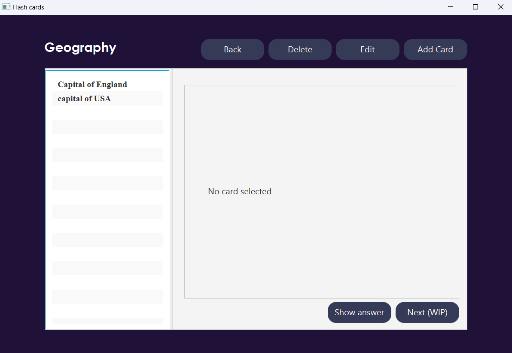
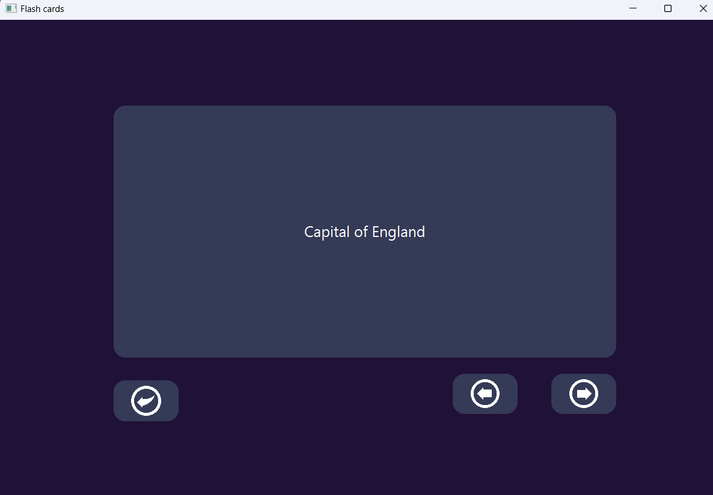
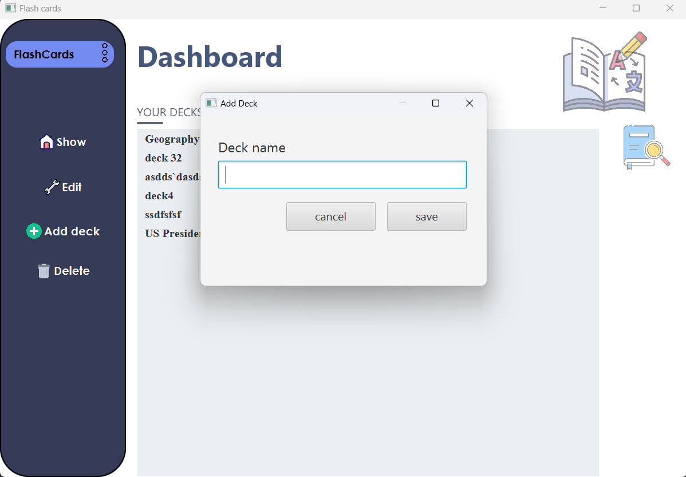

# Flashcards - Build with Javafx

#### Main Scene that will show all the Decks in Flash Card App

#### Add or Edit Cards in a Deck

#### Play cards in a deck

#### Show Answer

#### Add new Deck

## Getting Started

Run main method in Main.java file.

### Import Referenced libraries of JavaFX

inside the Java Projects in VS Code, attach referenced libraries and select all the JAR files of the JavaFx. This will include them in your project. Another way is to add them to the lib folder of the project as well.
